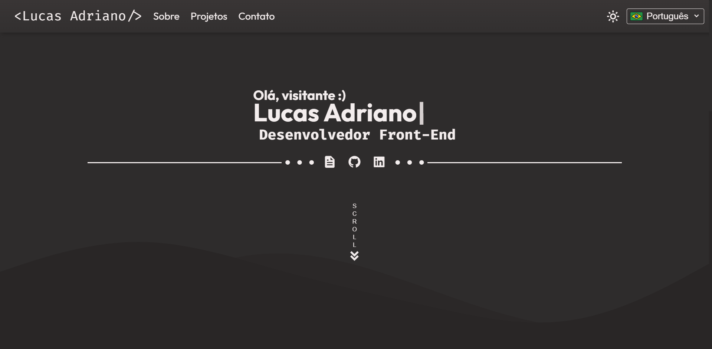

# Portfólio de Lucas Adriano

Este é o meu portfólio, desenvolvido utilizando **HTML**, **JavaScript** e conceitos avançados de **SASS**, como **mixins**, **funções** e **variáveis**. O site possui suporte para **modo claro e escuro** e é multilíngue, com versões em **português**, **inglês** e **espanhol**. A hospedagem foi realizada através do **Firebase**.



## Índice

-   <a href="#%EF%B8%8F-tecnologias-utilizadas">Tecnologias Utilizadas</a>
-   <a href="#-funcionalidades">Funcionalidades</a>
-   <a href="#-estrutura-do-projeto">Estrutura do Projeto</a>
-   <a href="#-como-executar-o-projeto">Como Executar o Projeto</a>
-   <a href="#-conclusão">Conclusão</a>
-   <a href="#-contato">Contato</a>

## 🛠️ Tecnologias Utilizadas

**HTML**: Utilizado para a estruturação das páginas.  
**CSS (SASS)**: Utilizado para a estilização das páginas, com o uso de mixins, variáveis e funções para otimização e reutilização de estilos.  
**JavaScript**: Utilizado para a interatividade do site, incluindo a troca de tema e a funcionalidade de seleção de idioma.  
**Firebase**: Utilizado para a hospedagem do site, garantindo acesso rápido e confiável.

## 🚀 Funcionalidades

-   **Modo Claro e Escuro**: Troca entre temas para proporcionar uma experiência de leitura personalizada.
-   **Suporte Multilíngue**: O site está disponível em português, inglês e espanhol, com tradução automática das principais seções.
-   **Design Responsivo**: A página se adapta a diferentes tamanhos de tela, garantindo uma navegação fluída em dispositivos móveis e desktops.

## 📁 Estrutura do Projeto

#### **firebaseConfig.js**: Arquivo com configurações para integração com o Firebase.
#### **public**

    - **pt-br/**: Página inicial para o idioma português (Brasil).
    - **en/**: Página inicial para o idioma inglês.
    - **es/**: Página inicial para o idioma espanhol.
    - **assets**
        - **images**: Contém as imagens do site.
        - **css**: Arquivos CSS gerais.
        - **docs**: Pasta do currículo em pdf.
        - **js**: Scripts JavaScript para funcionalidades como controle de tema e interações.
        - **scss**: Pasta com arquivos SASS organizados em múltiplas subpastas para reutilização e organização dos estilos.
            - **base**: Arquivos de estilo básicos, como reset de CSS e estilos globais.
            - **components**: Estilos específicos para componentes reutilizáveis, como botões, formulários, etc.
            - **components**: Estilos específicos para componentes reutilizáveis, como botões, formulários, etc.
            - **layout**: Estilos relacionados ao layout geral da página, como grid e estrutura de página.
            - **themes**: Arquivos de temas, incluindo as regras para o modo claro/escuro.
            - **sections**: Arquivos contendo mixins SASS para facilitar a reutilização de código.
            - **animations**: Definição de animações utilizadas no projeto.
            - **utils**: Contém arquivos utilitários como `mixins` e `variables`, para reutilização de estilo e facilitar a manutenção do código.

## 📝 Como Executar o Projeto

1. Clone este repositório:

    ```bash
    git clone https://github.com/lucasatdriano/portfolio
    ```

2. Acesse o diretório do projeto:

    ```bash
    cd portfolio/public/pt-br
    ```

3. Abra o arquivo `index.html` em seu navegador:

    ```bash
    open index.html  # Para macOS
    # ou
    start index.html  # Para Windows
    # ou
    xdg-open index.html  # Para Linux
    ```

## 🎓 Conclusão

Este portfólio é uma vitrine para minhas habilidades como desenvolvedor front-end, destacando o uso de **HTML**, **JavaScript** e **SASS** para criar um site interativo, responsivo e multilíngue. O objetivo é oferecer uma experiência de usuário personalizada, com funcionalidades como modo escuro e suporte a três idiomas.

## 📞 Contato

Este projeto foi desenvolvido por mim, Lucas Adriano. Para dúvidas ou sugestões, entre em contato:

-   **Email**: [lucasadriano@gmail.com](mailto:lucasatdriano@gmail.com)
-   **LinkedIn**: [Lucas Adriano](https://linkedin.com/in/lucasadrianodev)
-   **GitHub**: [Lucas Adriano](https://github.com/lucasatdriano)
